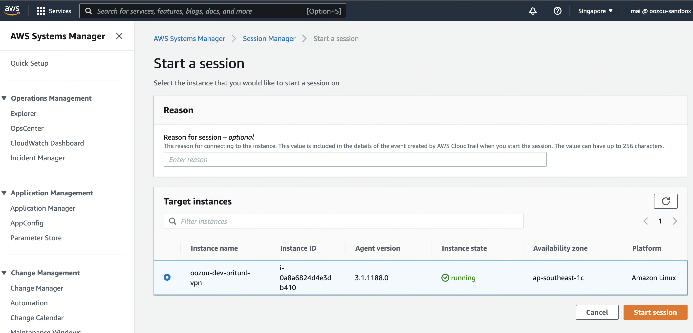
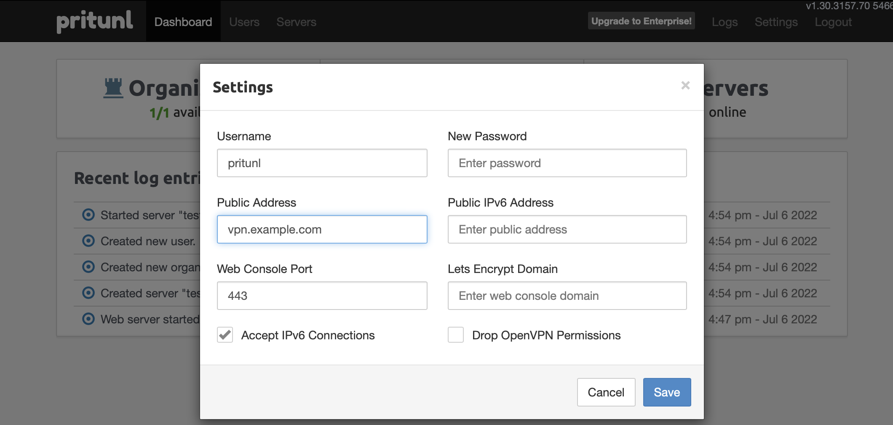
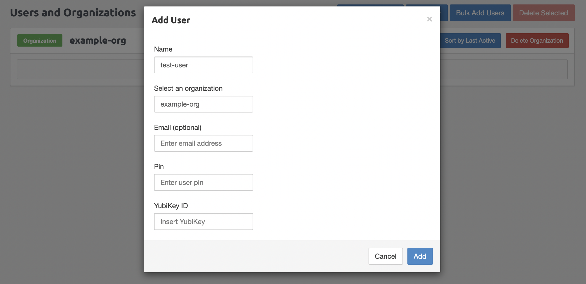

# AWS VPN (Pritunl) Terraform Module

Terraform module with create instance with Pritunl VPN on AWS.

## Usage

```terraform
module "vpn" {
  source = "git@github.com:<repository_name>/terraform-aws-pritunl-vpn.git?ref=v0.0.0"
  prefix             = "example"
  environment        = "dev"
  vpc_id             = "vpc-xxx"
  public_subnet_ids  = ["subnet-xxx", "subnet-xxx", "subnet-xxx"]
  private_subnet_ids = ["subnet-xxx", "subnet-xxx", "subnet-xxx"]
  instance_type             = "t3a.small"
  is_create_route53_reccord = true
  route53_zone_name         = "example.com"
  public_lb_vpn_domain      = "vpn" #vpn.example.com
  private_lb_vpn_domain     = "vpn-console" #vpn-console.example.com
  is_enabled_https_public = true
  security_group_ingress_rules = {
    allow_to_connect_vpn = {
      port        = "12383"
      cidr_blocks = ["0.0.0.0/0"]
      protocol    = "udp"
    }
  }
  tags = {
    workspace = "local-test"
  }
}
```

## HOW TO SET UP PRITUNL-VPN

### GO TO SSM CONSOLE FOR SESSION MANAGER



### GET Default Password

```shell
  sudo pritunl default-password # save for first login
```


### Login


### Server Setting

#### Require

- **Public Address** : Set to `Public DNS name` or `Public Loadbalancer`  for VPN Client ACCESS

#### Optional

- **Username** : New Username for Connect to VPN server
- **New Password** : New Password For For Connect to VPN server



### Create organization

- click on "Users" in nav bar
- click on "Add Organization"


### Create Server

- click on "Servers" in nav bar
- Click on "Add Server" Button

- Config Server
  - **name**: anything
  - **port**: default must be 12383 (must be match with ingress policy)
  - **DNS Server**: Default 8.8.8.8
  - **Virtual Network**: Leave Default (CIDR must be avalible)


### Attach Origanization to Server

- Click on "Attach Organization" Button


### Start VPN Server

- Click on "Start Server" Button


- Done


## Add User To Access VPN

### Create User

- Click on Users in NavBar
- Clicl on "Add User" Button


### Config User

- Config User
  - **Name**: anything
  - **Pin**: password to access VPN



### Download VPN File

## Set VPN Server to Private

```terraform
module "pritunl_vpn" {
  . . .
  is_enabled_https_public = false
}
```

## Migration

### Mount New EFS to Old Pritunl VPN

#### Config Security Group Client
add security goups efs-client of new efs to old pritunl VPN

- go to ec2 console
- select old pritunl-vpn -> Actions -> Security -> Change security groups
- add security group client for mount EFS

#### Mount New EFS To Old Pritunl VPN

- remote to old pritunl-vpn
- mount EFS

```shell
sudo mkdir /efs
sudo mount -t nfs4 -o nfsvers=4.1,rsize=1048576,wsize=1048576,hard,timeo=600,retrans=2,noresvport <efs_dns_name>:/ /efs
```

### Config MongoDB

#### Dump Mongodb From Old Pritunl VPN

```bash
mongodump --db=pritunl #dump
mv dump/ /efs/dump #move dump to efs
```

#### Restore MongoDB in New Pritunl VPN

```bash
mongorestore /efs/dump
```


<!-- BEGIN_TF_DOCS -->
## Requirements

| Name                                                                      | Version |
|---------------------------------------------------------------------------|---------|
| <a name="requirement_terraform"></a> [terraform](#requirement\_terraform) | >= 1.0  |
| <a name="requirement_aws"></a> [aws](#requirement\_aws)                   | >= 3.0  |

## Providers

| Name                                              | Version |
|---------------------------------------------------|---------|
| <a name="provider_aws"></a> [aws](#provider\_aws) | 4.29.0  |

## Modules

| Name                                                                                | Source                                                            | Version |
|-------------------------------------------------------------------------------------|-------------------------------------------------------------------|---------|
| <a name="module_efs"></a> [efs](#module\_efs)                                       | oozou/efs/aws                                                     | 1.0.3   |
| <a name="module_launch_template"></a> [launch\_template](#module\_launch\_template) | git::ssh://git@github.com/oozou/terraform-aws-launch-template.git | v1.0.2  |

## Resources

| Name                                                                                                                                           | Type        |
|------------------------------------------------------------------------------------------------------------------------------------------------|-------------|
| [aws_autoscaling_group.this](https://registry.terraform.io/providers/hashicorp/aws/latest/docs/resources/autoscaling_group)                    | resource    |
| [aws_autoscaling_policy.this](https://registry.terraform.io/providers/hashicorp/aws/latest/docs/resources/autoscaling_policy)                  | resource    |
| [aws_iam_instance_profile.this](https://registry.terraform.io/providers/hashicorp/aws/latest/docs/resources/iam_instance_profile)              | resource    |
| [aws_iam_role.this](https://registry.terraform.io/providers/hashicorp/aws/latest/docs/resources/iam_role)                                      | resource    |
| [aws_iam_role_policy.this](https://registry.terraform.io/providers/hashicorp/aws/latest/docs/resources/iam_role_policy)                        | resource    |
| [aws_iam_role_policy_attachment.this](https://registry.terraform.io/providers/hashicorp/aws/latest/docs/resources/iam_role_policy_attachment)  | resource    |
| [aws_lb.private](https://registry.terraform.io/providers/hashicorp/aws/latest/docs/resources/lb)                                               | resource    |
| [aws_lb.public](https://registry.terraform.io/providers/hashicorp/aws/latest/docs/resources/lb)                                                | resource    |
| [aws_lb_listener.private](https://registry.terraform.io/providers/hashicorp/aws/latest/docs/resources/lb_listener)                             | resource    |
| [aws_lb_listener.public](https://registry.terraform.io/providers/hashicorp/aws/latest/docs/resources/lb_listener)                              | resource    |
| [aws_lb_target_group.private](https://registry.terraform.io/providers/hashicorp/aws/latest/docs/resources/lb_target_group)                     | resource    |
| [aws_lb_target_group.public](https://registry.terraform.io/providers/hashicorp/aws/latest/docs/resources/lb_target_group)                      | resource    |
| [aws_route53_record.private](https://registry.terraform.io/providers/hashicorp/aws/latest/docs/resources/route53_record)                       | resource    |
| [aws_route53_record.public](https://registry.terraform.io/providers/hashicorp/aws/latest/docs/resources/route53_record)                        | resource    |
| [aws_security_group.this](https://registry.terraform.io/providers/hashicorp/aws/latest/docs/resources/security_group)                          | resource    |
| [aws_security_group_rule.ingress](https://registry.terraform.io/providers/hashicorp/aws/latest/docs/resources/security_group_rule)             | resource    |
| [aws_ami.amazon_linux](https://registry.terraform.io/providers/hashicorp/aws/latest/docs/data-sources/ami)                                     | data source |
| [aws_iam_policy_document.this](https://registry.terraform.io/providers/hashicorp/aws/latest/docs/data-sources/iam_policy_document)             | data source |
| [aws_iam_policy_document.this_assume_role](https://registry.terraform.io/providers/hashicorp/aws/latest/docs/data-sources/iam_policy_document) | data source |
| [aws_route53_zone.this](https://registry.terraform.io/providers/hashicorp/aws/latest/docs/data-sources/route53_zone)                           | data source |
| [aws_vpc.this](https://registry.terraform.io/providers/hashicorp/aws/latest/docs/data-sources/vpc)                                             | data source |

## Inputs

| Name                                                                                                                         | Description                                                                                                                                                                                                                                      | Type                                                                                                                                                                                      | Default                                                                                                                                                         | Required |
|------------------------------------------------------------------------------------------------------------------------------|--------------------------------------------------------------------------------------------------------------------------------------------------------------------------------------------------------------------------------------------------|-------------------------------------------------------------------------------------------------------------------------------------------------------------------------------------------|-----------------------------------------------------------------------------------------------------------------------------------------------------------------|:--------:|
| <a name="input_additional_sg_attacment_ids"></a> [additional\_sg\_attacment\_ids](#input\_additional\_sg\_attacment\_ids)    | (Optional) The ID of the security group.                                                                                                                                                                                                         | `list(string)`                                                                                                                                                                            | `[]`                                                                                                                                                            |    no    |
| <a name="input_ami"></a> [ami](#input\_ami)                                                                                  | (Optional) AMI to use for the instance. Required unless launch\_template is specified and the Launch Template specifes an AMI. If an AMI is specified in the Launch Template, setting ami will override the AMI specified in the Launch Template | `string`                                                                                                                                                                                  | `""`                                                                                                                                                            |    no    |
| <a name="input_custom_https_allow_cidr"></a> [custom\_https\_allow\_cidr](#input\_custom\_https\_allow\_cidr)                | cidr block for config pritunl vpn                                                                                                                                                                                                                | `list(string)`                                                                                                                                                                            | `null`                                                                                                                                                          |    no    |
| <a name="input_efs_backup_policy_enabled"></a> [efs\_backup\_policy\_enabled](#input\_efs\_backup\_policy\_enabled)          | If `true`, it will turn on automatic backups.                                                                                                                                                                                                    | `bool`                                                                                                                                                                                    | `true`                                                                                                                                                          |    no    |
| <a name="input_enable_ec2_monitoring"></a> [enable\_ec2\_monitoring](#input\_enable\_ec2\_monitoring)                        | Enables/disables detailed monitoring                                                                                                                                                                                                             | `bool`                                                                                                                                                                                    | `false`                                                                                                                                                         |    no    |
| <a name="input_enabled_backup"></a> [enabled\_backup](#input\_enabled\_backup)                                               | Enable Backup EFS                                                                                                                                                                                                                                | `bool`                                                                                                                                                                                    | `true`                                                                                                                                                          |    no    |
| <a name="input_environment"></a> [environment](#input\_environment)                                                          | Environment Variable used as a prefix                                                                                                                                                                                                            | `string`                                                                                                                                                                                  | n/a                                                                                                                                                             |   yes    |
| <a name="input_instance_type"></a> [instance\_type](#input\_instance\_type)                                                  | (Optional) The instance type to use for the instance. Updates to this field will trigger a stop/start of the EC2 instance.                                                                                                                       | `string`                                                                                                                                                                                  | `"t2.medium"`                                                                                                                                                   |    no    |
| <a name="input_is_create_private_lb"></a> [is\_create\_private\_lb](#input\_is\_create\_private\_lb)                         | if true this module will not create private lb for cost optimization                                                                                                                                                                             | `bool`                                                                                                                                                                                    | `true`                                                                                                                                                          |    no    |
| <a name="input_is_create_route53_reccord"></a> [is\_create\_route53\_reccord](#input\_is\_create\_route53\_reccord)          | if true will create route53 reccord for vpn, vpn console                                                                                                                                                                                         | `bool`                                                                                                                                                                                    | `false`                                                                                                                                                         |    no    |
| <a name="input_is_create_security_group"></a> [is\_create\_security\_group](#input\_is\_create\_security\_group)             | Flag to toggle security group creation                                                                                                                                                                                                           | `bool`                                                                                                                                                                                    | `true`                                                                                                                                                          |    no    |
| <a name="input_is_enabled_https_public"></a> [is\_enabled\_https\_public](#input\_is\_enabled\_https\_public)                | if true will enable https to public loadbalancer else enable to private loadbalancer                                                                                                                                                             | `bool`                                                                                                                                                                                    | `true`                                                                                                                                                          |    no    |
| <a name="input_key_name"></a> [key\_name](#input\_key\_name)                                                                 | Key name of the Key Pair to use for the vpn instance; which can be managed using                                                                                                                                                                 | `string`                                                                                                                                                                                  | `null`                                                                                                                                                          |    no    |
| <a name="input_prefix"></a> [prefix](#input\_prefix)                                                                         | The prefix name of customer to be displayed in AWS console and resource                                                                                                                                                                          | `string`                                                                                                                                                                                  | n/a                                                                                                                                                             |   yes    |
| <a name="input_private_lb_vpn_domain"></a> [private\_lb\_vpn\_domain](#input\_private\_lb\_vpn\_domain)                      | domain of vpn console output will be <var.vpn\_domain>.<var.route53\_zone\_name>                                                                                                                                                                 | `string`                                                                                                                                                                                  | `"vpn-console"`                                                                                                                                                 |    no    |
| <a name="input_private_rule"></a> [private\_rule](#input\_private\_rule)                                                     | private rule for run connect vpn                                                                                                                                                                                                                 | <pre>list(object({<br>    port                  = number<br>    protocol              = string<br>    health_check_port     = number<br>    health_check_protocol = string<br>  }))</pre> | `[]`                                                                                                                                                            |    no    |
| <a name="input_private_subnet_ids"></a> [private\_subnet\_ids](#input\_private\_subnet\_ids)                                 | The List of the private subnet ID to deploy instance and private lb for vpn relate to VPC                                                                                                                                                        | `list(string)`                                                                                                                                                                            | n/a                                                                                                                                                             |   yes    |
| <a name="input_public_lb_vpn_domain"></a> [public\_lb\_vpn\_domain](#input\_public\_lb\_vpn\_domain)                         | domain of vpn output will be <var.vpn\_domain>.<var.route53\_zone\_name>                                                                                                                                                                         | `string`                                                                                                                                                                                  | `"vpn"`                                                                                                                                                         |    no    |
| <a name="input_public_rule"></a> [public\_rule](#input\_public\_rule)                                                        | public rule for run connect vpn                                                                                                                                                                                                                  | <pre>list(object({<br>    port                  = number<br>    protocol              = string<br>    health_check_port     = number<br>    health_check_protocol = string<br>  }))</pre> | <pre>[<br>  {<br>    "health_check_port": 443,<br>    "health_check_protocol": "TCP",<br>    "port": 12383,<br>    "protocol": "UDP"<br>  }<br>]</pre>          |    no    |
| <a name="input_public_subnet_ids"></a> [public\_subnet\_ids](#input\_public\_subnet\_ids)                                    | The List of the subnet ID to deploy Public Loadbalancer relate to VPC                                                                                                                                                                            | `list(string)`                                                                                                                                                                            | n/a                                                                                                                                                             |   yes    |
| <a name="input_route53_zone_name"></a> [route53\_zone\_name](#input\_route53\_zone\_name)                                    | This is the name of the hosted zone                                                                                                                                                                                                              | `string`                                                                                                                                                                                  | `""`                                                                                                                                                            |    no    |
| <a name="input_security_group_ingress_rules"></a> [security\_group\_ingress\_rules](#input\_security\_group\_ingress\_rules) | Map of ingress and any specific/overriding attributes to be created                                                                                                                                                                              | `any`                                                                                                                                                                                     | <pre>{<br>  "allow_to_connect_vpn": {<br>    "cidr_blocks": [<br>      "0.0.0.0/0"<br>    ],<br>    "port": "12383",<br>    "protocol": "udp"<br>  }<br>}</pre> |    no    |
| <a name="input_tags"></a> [tags](#input\_tags)                                                                               | Tags to add more; default tags contian {terraform=true, environment=var.environment}                                                                                                                                                             | `map(string)`                                                                                                                                                                             | `{}`                                                                                                                                                            |    no    |
| <a name="input_vpc_id"></a> [vpc\_id](#input\_vpc\_id)                                                                       | The ID of the VPC                                                                                                                                                                                                                                | `string`                                                                                                                                                                                  | n/a                                                                                                                                                             |   yes    |

## Outputs

| Name                                                                                  | Description                                            |
|---------------------------------------------------------------------------------------|--------------------------------------------------------|
| <a name="output_efs_dns_name"></a> [efs\_dns\_name](#output\_efs\_dns\_name)          | The DNS name for the filesystem                        |
| <a name="output_efs_id"></a> [efs\_id](#output\_efs\_id)                              | The ID that identifies the file system for pritunl vpn |
| <a name="output_lb_private_dns"></a> [lb\_private\_dns](#output\_lb\_private\_dns)    | The DNS name of the private load balancer.             |
| <a name="output_lb_public_dns"></a> [lb\_public\_dns](#output\_lb\_public\_dns)       | The DNS name of the public load balancer.              |
| <a name="output_vpn_private_dns"></a> [vpn\_private\_dns](#output\_vpn\_private\_dns) | private dns for connect vpn server                     |
| <a name="output_vpn_public_dns"></a> [vpn\_public\_dns](#output\_vpn\_public\_dns)    | public dns for connect vpn server                      |
<!-- END_TF_DOCS -->
